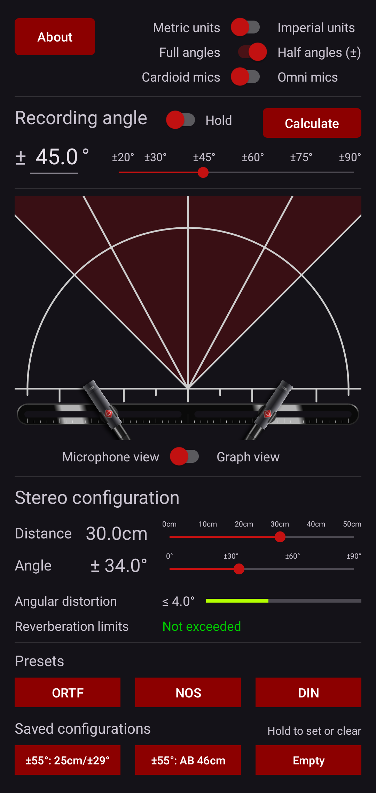
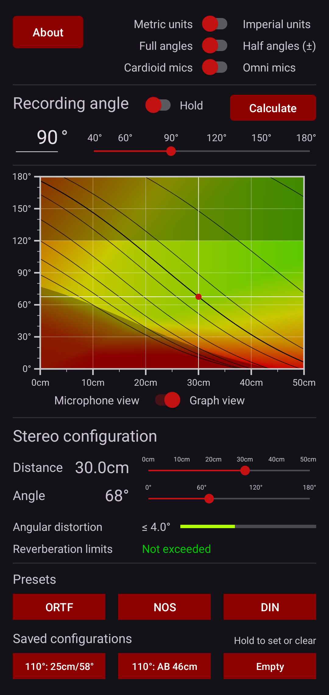
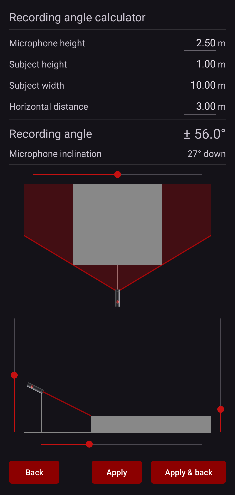
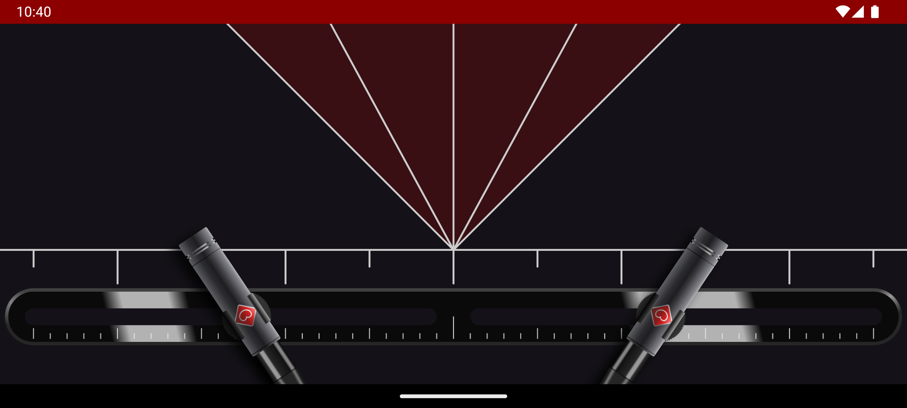

                

# Stereophonic Calculator

Quickly find stereo microphone configurations for specific recording angles with this Android app.

Inspired by and based on the data of [Michael Williams][williams]'s paper **"The stereophonic zoom"** ([PDF][paperpdf], [Citation][papercite]).

> The "Stereophonic Zoom" enables the sound recording engineer to get much nearer to the optimum result in the great majority of recording environments.

—Michael Williams, The stereophonic zoom, page 2

## Features

- Set a desired Stereophonic Recording Angle (SRA) and explore combinations of microphone distance and angle to achieve it
- Immediately see angular distortion and reverberation limits for each configuration
- Microphone type switchable to omni mode for finding _AB_ (spaced pair) configurations
- Live, to-scale **graphic representation** of the two microphones, showing distance and angle between them as well as the recording angle
- **Interactive graph of configuration space**, modeled after the figures in _The stereophonic zoom_ with a heat map for angular distortion and outlines of reverberation limits
- **Angle calculator** page for calculating a recording angle from basic length measurements
- **Presets** for widely used configurations: **ORTF, NOS, DIN**
- Programmable buttons for **user-defined** configurations
- Units switchable between metric and imperial
- Angles switchable between full and half (±)

## Screenshots

Main activity, showing the microphone view:

---

Main activity with graph view activated:

---

Calculating the best recording angle from distance measurements:

---

Main activity in landscape mode, showing the microphone view in full screen:

[williams]: http://www.williamsmmad.com
[paperpdf]: https://www.gracedesign.com/support/StereoZoom10.pdf
[papercite]: https://api.semanticscholar.org/CorpusID:202598177